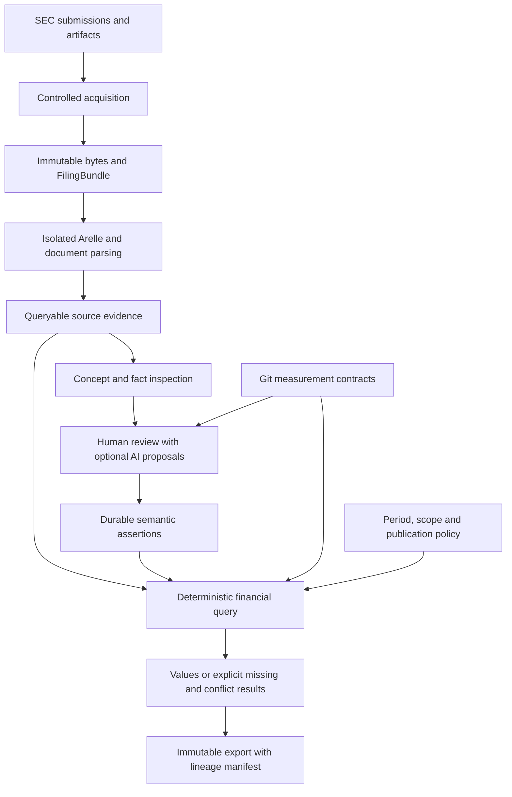

# Target architecture

**Status:** recommended target, not implemented. [Migration](migration-plan.md) defines staged delivery. Persistent grains are specified in [data model](data-model.md); [decisions](decisions.md) compares alternatives.

## Derivation from the product

The product answers three different questions: what was reported, what economic claim we can defend about it, and which reported value answers a particular analytical question. These require different identities but not separate services.

A minimal useful query is:

```text
issuer CIK
+ canonical measurement contract
+ exact economic period
+ entity/consolidation scope
+ dimensional slice
+ unit
+ filing/publication policy
→ value with evidence, or an explicit reason no value can be selected
```

Success means a researcher can compare the requested quantities, inspect every source occurrence used, and reproduce the selection conditions. Correct missing values are a product result. Mapping coverage alone is not success.

The first release serves US-GAAP operating-company reported metrics for a bounded filing set. Banks and other materially different revenue models remain visible in source inspection but do not inherit operating-company revenue mappings. Initial units are reported units, with no currency translation. Original report contexts define periods; neither calendar labels nor annualization manufacture observations.

## One application, three responsibilities



1. **Evidence:** bytes plus a replaceable relational index of the filing's XBRL and document structure.
2. **Knowledge:** precise canonical contracts and reviewed assertions, including why, scope, and history.
3. **Queries/publications:** application of that knowledge and a declared selection policy to produce economic observations.

Keep `source` and `registry` as practical ownership namespaces. Add an `analysis` schema only for useful SQL views; initial results and exports need no durable observation tables. Names do not define the architecture. No `reference`, `semantic`, and `analytics` databases or services are required.

The six conceptual operations remain distinguishable:

| Question | Representation | Why the boundary matters |
|---|---|---|
| What did the filer report? | Artifacts and fact occurrences | No interpretation overwrites evidence |
| What does XBRL declare? | Report-scoped declarations, contexts, resources, networks | Filed DTS differs from application economic claims |
| What have we asserted? | Contracts and mapping revisions | Human knowledge is independently durable |
| Which assertions apply? | Query-time mapping application and predicate results | Acceptance alone does not qualify every fact |
| Which observation answers the question? | Candidate qualification and selection result | Many mapped facts are not the requested period/scope |
| What is delivered for analysis? | Long-form result and immutable publication | Dataset policy and history are explicit |

These are inspectable stages in one query, not six materialized copies of the same fact.

## XBRL-native where XBRL already provides the model

Use exact expanded QNames for source concept identity. Prefixes are display syntax; namespaces are not retrieval URLs and must not undergo HTTP URL canonicalization. Namespace releases remain distinct identities. A QName identifies a concept; a report-scoped declaration records how the loaded DTS declares it. Report observations must never overwrite global concept metadata. The native fact/context/unit/relationship concepts follow the [XBRL building blocks](https://specifications.xbrl.org/xbrl-essentials.html).

Use the OIM's aspect-oriented view as a guide to the analytical API: concept, entity, period, unit, language, and taxonomy dimensions describe a fact. OIM is not a replacement for the provenance-rich source store; the application also needs the original occurrence and filed declaration/network evidence. [Open Information Model](https://www.xbrl.org/Specification/oim/REC-2021-10-13/oim-REC-2021-10-13.html).

Arelle owns loading, QName resolution, DTS discovery, transformations, resolved values, and effective XBRL relationships. The adapter selects and serializes information the application needs, attaches source locations, and fails explicitly on unrepresentable mandatory information. It must not implement its own XBRL validation engine. Arelle exposes [declaration/relationship objects](https://arelle.readthedocs.io/en/latest/apidocs/arelle/arelle.ModelDtsObject.html) and [fact/context/dimension objects](https://arelle.readthedocs.io/en/latest/apidocs/arelle/arelle.ModelInstanceObject.html).

The target SQL surface is a faithful **supported subset** of XBRL, not a full serialization of ModelXbrl. It preserves all supported item occurrences, their aspects, useful DTS resources, and effective networks. Raw arc prohibition/priority history and uncommon structures remain available in immutable artifacts. Unsupported structures get explicit diagnostics and publication gates; silently treating an unsupported context as empty is forbidden.

Application-specific entities are the measurement contract, semantic assertion/review, analytical request, selection explanation, publication manifest, and later formula definition. Do not add a second generic “filed economic observation” table between facts and queries.

## Dimensions and observation identity

A source dimension stays an exact dimension QName plus an explicit member QName or namespace-complete typed member XML, under a context and segment/scenario location. Preserve filed occurrences even if invalid. Default members are DTS semantics, not fabricated context rows. Effective aspect comparison may consult Arelle's dimensional interpretation while retaining the filed form. [XBRL Dimensions](https://specifications.xbrl.org/work-product-index-group-dimensions-dimensions.html).

Typed-member XML hashes provide integrity, not semantic equivalence. Prefix changes, namespace use inside content, and schema-defined typed equality require care. Initially, compare conservatively within the supported profile; refuse to merge uncertain typed values. Do not build a universal canonical member dictionary.

An analytical observation slot is:

```text
(issuer/entity identity,
 canonical key + definition hash,
 exact period,
 economic entity/consolidation basis,
 full dimensional slice,
 unit,
 reporting basis required by the contract)
```

A **reported assertion about that slot** adds the filing/report and supporting source occurrences. A **selected result** adds the query's publication policy and knowledge cutoffs. A source occurrence ID is not the slot identity; the same slot can legitimately have multiple filed assertions over time.

Consolidated revenue and Europe revenue can share the revenue concept but occupy different slots. Duration alone does not make a fact annual: January, a quarter, YTD, and FY are different periods. The source concept is not replicated as `annual_revenue`, `quarterly_revenue`, and `europe_revenue`.

Some distinctions belong inside the concept contract: gross/net, GAAP/adjusted, including/excluding goodwill, income attributable to parent/including noncontrolling interests. They cannot all be recovered from dimensions. Do not invent a generic dimension to hide an undefined metric boundary.

## Additional meaning without an ontology

Use a lightweight canonical registry with prose measurement definitions, machine-checkable compatibility fields, and cited taxonomy/document evidence. A reported metric can reference several exact standard concept QNames as evidence; that does not make all of them equivalent. Extension mappings target the reviewed contract directly.

A relational mapping graph is already a knowledge graph in the ordinary sense: source concepts, declarations, contracts, decisions, and evidence are connected. Neither graph storage nor OWL reasoning follows from that fact. Human/agent inspectors can emit a small neighborhood graph from SQL when useful.

Keep relationship purposes distinct:

| Relationship | Representation / consequence |
|---|---|
| Exact/broader/narrower/related source meaning | Reviewed mapping assertion; only exact can feed strict values |
| Alternative names | Contract aliases for search; no mapping inference |
| Product/service specialization of revenue | Optional reviewed canonical hierarchy when navigation needs it; not a sum rule |
| Accounting subtotal/component | Filed calculation network as evidence; an executable formula only after separate approval |
| Dimension/member hierarchy | Native DTS definition network; not a canonical metric hierarchy |
| Derived-from | Versioned formula and input lineage when derived values are introduced |
| Taxonomy replacement/deprecation | Reference evidence; not automatic equivalence |

Do not add all possible relationship tables now. The first release needs the assertion relation and existing source networks. Defer canonical hierarchy storage until there is a concrete navigation/query consumer.

## Mapping application is a transparent query

For every fact of a queried source concept:

1. Resolve the named semantic revision/snapshot; candidates, revoked decisions, and stale definition hashes are not trusted input.
2. Evaluate its explicit issuer/report/declaration guards and any supported aspect conditions. Unknown or unsupported conditions do not match.
3. Check basic target compatibility (numeric kind, instant/duration, unit dimension); keep all original aspects and values.
4. Return application records containing the source occurrence, assertion revision, canonical definition, condition outcomes, and applicability state.

“Mapped fact” is this result, not a second permanent fact table and not yet a statement value. A non-exact assertion is valuable inspectable knowledge but cannot publish an exact canonical value. New filings outside a reviewed issuer-report scope generate review work, not silent extrapolation. Details are in [mapping and review](mapping-and-review.md).

## Deterministic selection, including the cases where there is no answer

Implement one typed `FinancialRequest` and one selector with reason-bearing stages. SQL retrieves bounded rows and joins; typed Python performs the small policy decisions. Do not implement the same policy twice in SQL and Python.

The first selection profile is `reported-annual-v1`:

1. The caller supplies an explicit filing accession, issuer, metric, exact start/end or instant, reported currency/unit, and `consolidated` scope. A convenience FY request is allowed only after an unambiguous filing-specific fiscal period has been established from filed evidence or a reviewed request manifest. No 365-day/year-end heuristic alone.
2. Require successful compatible extraction, relevant source locations, and the reviewed current contract. A context entity must agree with the registrant using its filed identifier scheme; a different entity is not relabeled with the filing's CIK.
3. Require applicable accepted exact mapping, valid non-nil numeric value, correct unit and period. Negative values are valid where the contract allows them. Preserve filed sign; never flip an expense from `balance=debit` or a calculation weight.
4. For this initial profile, require no filed dimensions, no opaque non-dimensional context qualifiers, and positive evidence that the metric/statement scope represents the requested reporting entity. Dimension absence alone is not proof of consolidation. Review can pin report-specific statement evidence; ambiguous entity/scope fails closed. Explicit consolidated members are initially unsupported, not stripped.
5. Preserve all qualifying occurrences. Group only demonstrably equivalent aspects; then compare values. Initially allow duplicate support only for identical Decimal value **and identical accuracy metadata**. Differing precision/decimals or merely rounding-consistent values return `accuracy_review_required`; later support may use Arelle's duplicate classification without deleting occurrences.
6. If all qualified support describes one identical value/accuracy group, return that value with **all** support occurrences. Multiple concepts mapped to the same contract can be co-support, but equal numbers alone do not prove their aspects/basis are identical. Different qualified values return `conflicting_values`; do not pick the first, largest, most precise, or standard-tagged fact.
7. A footnote or diagnostic affecting the measurement must be available for review. A known unsupported semantic condition yields `unsupported_semantics`, not a trusted number.

The profile deliberately excludes dimensional totals, FX conversion, segment summation, annualization, quarter-by-subtraction, and accounting reconstruction. These are separate future products. Strictness trades coverage for a usable, defensible first result.

The result is long-form, one row per requested slot: value (Decimal string in JSON/CSV), unit, period, definition hash, filing/report, scope, supporting occurrence pins, and state. A missing result has a reason and counts at each filtering stage; it is never silently zero or absent from the response. Reasons include no filing, no extraction, unsupported source structure, unmapped, candidate only, stale definition, guard not met, non-exact only, wrong entity/period/unit/slice, nil, invalid value, accuracy review, conflicting values, and unknown availability. Multiple reasons can be reported with a primary earliest blocking stage.

## Time, amendments, and restatements

There are four different clocks:

| Clock | Meaning | Policy |
|---|---|---|
| Economic period | When the measured activity/balance applies | Context lexical values preserved; analytical date boundaries derived separately |
| Filing availability | When this submission became public | Use sourced SEC acceptance timestamp as the declared availability proxy; unknown stays unknown |
| Local availability | When this installation obtained evidence | Acquisition receipt; needed for “what could this installation have used?” |
| Semantic knowledge | When a decision became accepted/revoked locally | Immutable ledger revisions; cannot be backdated to the economic period |

`extracted_at` is none of these economic/public knowledge clocks. For date-only XBRL instant/end values, distinguish source lexical date from the XBRL boundary interpretation and an analytical inclusive reporting date. Do not make timezone-less values UTC instants by fiat.

M3 exposes per-filing assertions only. M4 introduces named policies:

- **`as-filed(accession)`**: use just that filing's assertions, including explicitly requested comparative periods.
- **`latest-reported-as-of(T)`**: among assertions for the same slot available by T, consider the latest acceptance-time cohort. Within that cohort, run qualification and conflict checks. If the latest report contains a relevant but invalid/conflicting claim, surface that state; do not silently fall back to a prettier older value. A later filing with no relevant claim does not erase earlier data.
- **`first-reported`**: choose the earliest available reporting cohort for that slot, then apply the same conflict rules. “First” is relative to an explicitly enumerated corpus, not all SEC history unless coverage proves it.

A latest reported comparative is not necessarily a restatement: it can be a reclassification or another basis change. No automatic filing-wide supersession. Store an evidence-backed `amends` edge when justified, but replacement occurs at observation scope. Partial amendments do not erase unchanged original observations. A formal `restates` classification requires evidence of affected metrics/periods/basis and is deferred until needed.

Separate two historical questions in the API:

```text
public_as_of=T, semantic_snapshot=current
    = historical filings interpreted with today's reviewed knowledge

public_as_of=T, semantic_as_of=S, acquired_as_of=A (optional)
    = constrained public, semantic, and optionally local knowledge
```

The first is retrospective normalization, not a claim that today's mapping existed at T. A semantic-as-of request must also specify the ContractRef for each metric (or a saved semantic/publication manifest containing those refs). Do not infer the historically active YAML contract from Git author dates or today's mirror. Require evidence that the contract content was recorded by S, such as a retained decision revision or publication. An explicitly requested retired contract is a historical meaning, not the current metric definition.

Select each mapping chain's latest revision within S, not today's tip filtered afterward, and require its target hash to match the requested ContractRef. Unknown historical contract content blocks the historical query. Equal timestamps are disambiguated by chain/revision order, not by treating independent conflicting decisions as interchangeable. A simple semantic cutoff does not reconstruct an unrecorded historical deployment: the query uses a declared parser/selector implementation over constrained evidence. Exact prior system outputs require a saved publication manifest. Automatic reconstruction of which YAML version was deployed at every past instant is deliberately not promised, so no contract-activation event framework is required.

A dataset manifest pins all clocks/policies, the examined corpus, and code/semantic inputs. No single `known_at` column can honestly replace them. Later trading datasets must additionally define dissemination/tradability assumptions, securities, prices, and delistings; these are outside this release.

## Durability and lineage

Keep raw bundles, Git contracts, mapping history, and exported publications. Current extraction tables, affected-fact queries, evidence previews, application results, and candidate qualification are regenerable. A result's lineage is:

```text
publication + row key + request/policy
 → canonical contract snapshot + mapping revision(s) + evidence
 → selected/supporting source occurrences with preserved aspect/value snapshot
 → accession + report input + bundle descriptor pin
 → artifact relative path + SHA-256 + locator
 → original bytes (and continuation/footnote/taxonomy evidence)
```

Exports retain compact snapshots of the occurrences actually used and the complete selection outcome. They do not embed every fact affected by a mapping. This allows current parser rows to be replaced without breaking old published lineage. A pointer to a bigint source fact is a live convenience only. An export can still be inspected if its parser environment is unavailable; exact replay additionally requires the saved code/lockfile and bundle inventory. Inspection and executable replay are different guarantees.

Publish from a consistent DB read snapshot and a single loaded contract snapshot; verify YAML/mirror coherence. Write output and manifest to a temporary directory, hash contents, then publish atomically through storage utilities. Revoke an erroneous mapping by appending history, recompute new results, and mark dependent publications withdrawn through a separate notice referencing the publication. Never edit the old dataset bytes or retroactively pretend they were correct.

## Growth without replacing the foundations

Add metrics by writing contracts and reviewed assertions. Add dimensions first as preserved query slices, then reviewed canonical member associations only where comparison needs them. Add derivations as formulas over explicit input observations. Add official taxonomy packages as pinned evidence attachments if the filing DTS lacks required material; no fake filing should own them. Add a relational package index only once repeated queries justify it.

When data volume makes bounded live queries too slow, materialize the same application/selection contracts with measured invalidation requirements. If a substantial dependency graph emerges, reassess SQLMesh/dbt. Neither change alters source identity, assertion meaning, or publication lineage. External datasets later enter with their own source identities and availability clocks; they do not overwrite filed facts.
