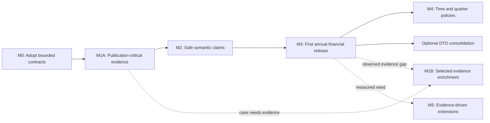

# Migration from the actual repository

**Status:** recommended implementation plan. This work delivers documents only. M0 records adoption and freezes the M1A → M2 → M3 → M4 path before production work starts. M1B additions require a documented evidence need. See [feedback assessment and disagreements](feedback-assessment.md) for the 2026-09-05 revision. Historical Phase 2A/2B/2C names are not reused, and no old applied migration is edited. M5 consists of separately gated options, not authorization for all future infrastructure.

## Change inventory

| Action | Current component | Specific outcome |
|---|---|---|
| KEEP | `sec/`, `storage/`, `domain/bundle.py`, acquisition orchestration | SEC/bundle/URI/IXDS contracts retained; no downloader replacement |
| KEEP | `domain/concept_id.py`, `domain/report_key.py` | Exact QName identity and report input identity unchanged |
| KEEP | Arelle worker, resolver/network guard, closure/replay | Closed-world offline boundary maintained |
| KEEP | Source context, unit, occurrence, dimension and network machinery | Extend missing fidelity; never deduplicate source facts |
| KEEP | `parsing/`, `xbrl/source_documents.py`, document tables/tests | Located disclosure evidence retained |
| KEEP | `registry/metrics.yml` and append-only mapping ledger | Existing authoring ownership preserved |
| KEEP | Applied `0001_source_v2.py`, `0002_registry.py`; fixture history | Historical DDL and evidence are not rewritten |
| MODIFY | `source_records.py`, `_source_build.py`, `extract.py`, `source_wire.py`, `db/source*.py` | M1A: receipt, supported network identity, capability reporting and integrity; M1B: justified role/footnote/typed-domain persistence |
| MODIFY | `registry/models.py`, `hashing.py`, `mapping.py`, `service.py`, `db/registry*.py` | Precise contracts, historical content, validated conditions/evidence and correction transactions |
| MODIFY | `registry/views.py`, `export.py`, CLI | Bounded concept/fact inspection, old/current contract display, explicit live-vs-historical state |
| REPLACE | Repetitive native wire codecs and dual adapter DTOs | One validated boundary record family, after first financial delivery and only with parity proof |
| REPLACE | Unqualified future “latest value”/scope-precedence plans | Named selector/publication policies with explicit missing/conflict results |
| DELETE | Unused `entry_document_id` after receipt cutover | Full report input/BundleRef replaces empty singular-entrypoint column |
| DELETE | Confirmed obsolete codecs/re-export shims/legacy branches during consolidation | No generic base framework or parallel serializer path left behind |
| ADD | `inspection/` bounded query/response modules | Agent/human evidence packets over existing native tables |
| ADD | `financials/` request, application, selection, explanation, export modules | One implementation of semantic policies, with views only where beneficial |
| ADD | New Alembic revisions and focused fixtures | Extend schema and enforce knowledge immutability without resetting data |
| DO NOT ADD | Mandatory `reference.*`, second binding ledger, ontology/graph service, SQLMesh | Not needed for first financial release |

`semantic-registry/` remains a historical archive under current project rules. Do not restore it as live authority or delete evidence simply because the architecture changed. Superseded planning documents were consolidated as recorded in [documentation consolidation](documentation-consolidation.md); evidence reviews and the unrelated pre-existing `-l` file are retained.

## Sequence and release gates

M1B and M5 are optional branches, not prerequisites for M4. A specific M1B addition can block an individual M2/M3 case if its evidence cannot otherwise be inspected safely; completing every M1B feature never becomes a blanket release gate. M5 features requiring temporal semantics still depend on the relevant M4 policy.

Each numbered work item below should normally be one reviewable change or a small PR pair. A phase ends with one supported executable path. Do not combine source schema fidelity work, ledger semantics, and serializer replacement into one large cutover.

## M0 — Adopt the recommendation and establish the financial benchmark

**Objective:** turn independent recommendations into a narrow executable scope without pretending deferred hypotheses are settled.

**Architectural change:** record chosen decisions in a new ADR and update the documentation index and current implementation contracts to identify adopted target decisions. The consolidation record preserves historical requirements. No schema or runtime changes.

**Implementation work:**

1. Review D1–D8 and explicitly adopt/adjust them. Record the mandatory M1A/M2/M3/M4 scope and the case-triggered M1B/M5 gates. Update `AGENTS.md`, `docs/README.md`, `docs/architecture.md`, `docs/normalization.md`, `docs/data-model.md`, and target-package status consistently. Documentation consolidation has removed competing plans, but has not adopted or implemented this recommendation.
2. Inventory the actual local DB revision, report/filing counts, registry rows by status/hash, and all local bundles. This assessment did not inspect that data. Use read-only counts first; never infer live decisions from historical JSON rules or tests.
3. Back up registry history including every revision, current/historical contract content available from Git, and bundle descriptors/objects. Existing export includes history, but it is not a demonstrated restore path. Restore into a separately configured guarded test database before any later migration.
4. Define a bounded benchmark from the six accessions in `fixtures/corpus.toml`: annual eBay pair and Walmart for initial values, eBay amendment as a non-replacement case, JPMorgan and Coca-Cola quarterlies for scope/period counterexamples. No live SEC fetching is required for the architecture task or default tests.
5. Create a reviewed expected-result manifest for the eight proposed initial metrics, exact periods/units/entity scopes, source locators, and expected missing/conflict cases. Use the real rendered filing for each expected value; do not derive expected values from the same selector being tested. Resolve which keys need narrower replacement definitions.
6. For each case, inventory required disclosure/network/resource evidence, what extraction exposes, and what remains unassessed. Identify the smallest reader or M1B addition needed to review it. Omitted SQL content is not evidence of irrelevance. Freeze economic boundaries here; M2 implements their registry representation. Record baseline review effort if available, without delaying M3 for a large study.

**Files:** the living docs above; new ADR (next unused number); proposed `fixtures/analysis/` manifest and `tests/helpers/financial_cases.py`. Preserve `fixtures/manifests/` and existing corpus probes.

**Tests and acceptance:** schema inventory and restore report; manually checked expected values or explicitly documented missingness for every requested slot. At least one extension case and one negative non-GAAP/broader case must be represented. Existing fixture availability is verified by hashes. The adopted scope explicitly says no automatic wider mapping reuse, no currency conversion, and no full-history claims.

**Data/removal:** backups only; no production deletes. The consolidation record has already retired conflicting plans and retained useful reasoning; M0 records implementation adoption separately.

**Dependency:** none. **Risk:** benchmark values could accidentally copy today's assumptions; independent source verification is essential. **New capability:** one agreed financial release target and a recovery path for curated knowledge.

## M1A — Publication-critical evidence and useful inspection

**Objective:** establish trustworthy inputs and inspectable evidence for the bounded release without requiring every useful XBRL resource to have a relational table.

**Architectural change:** retain the worker, storage boundary and per-filing atomic replacement. Add exact extraction receipts, preserve the complete identity of already-supported networks, and expose capability limits through the inspector. No canonical observations yet.

**Work packages:**

1. **Extraction receipt.** Add BundleRef/config/lock/parser evidence to `source.xbrl_report`; pass it from `SourceExtractService` through persistence. Stage nullable fields for old rows, then require verified receipts for publication. Drop always-null `entry_document_id` once no reader/writer uses it. Preserve all IXDS report members.
2. **Existing identity and failure guarantees.** Carry link and arc QNames from the exact Arelle base-set key into supported relationships and resource associations. This is a bounded repair to existing evidence, not a new network framework. Keep current fatal handling of non-dimensional contexts, tuples and fractions. SQL preservation of opaque context fragments is not required for M1A. Report unsupported structures and failed/missing extraction; never represent them as an empty or consolidated context.
3. **Integrity and independent completeness.** Validate same-report declaration/context/unit references, explicit/typed dimension structure, and context/unit ID collisions across report members. Add named composite DB constraints where appropriate after preflight/rebuild. Independently inventory fixture occurrences, including hidden Inline facts and continuations. Keep DTO/persisted count checks but retain a separate upstream inventoried count; do not call a count derived from emitted rows an independent oracle.
4. **Concept/fact inspector.** Query existing declarations/resources, role-scoped neighborhoods, dimensions/units, representative facts, historical usage and proposals with SQL pagination. Return typed JSON/Markdown, source pins, counts/cursors and capability status. For evidence absent from SQL, permit a pinned excerpt or small offline Arelle reader producing the same packet; relationships must be resolved by Arelle, not guessed from nearby text. Add only readers needed by M0/M2 cases. If relevance or attribution cannot be established, return `evidence_not_assessed` and block publication of that case.

**Affected files:** `ingestion/source_extract.py`; `xbrl/extract.py`, `config.py`, `source_records.py`, `_source_build.py`, `source_wire.py`; `db/source_schema.py`, `source.py`; new `db/inspection.py`, `inspection/models.py`, `inspection/service.py`; `cli.py`. Retain the existing serializer during these behavior changes.

**Schema/data:** next unused Alembic revision(s) after the current `0002_registry`: receipt fields, network QName fields and appropriate integrity constraints. No blanket role/arcrole/footnote tables, typed-domain enrichment or opaque-context storage. New required fields begin nullable for old rows; those rows are publication-ineligible until **offline extraction of the exact verified bundle**. Never invent provenance. Bump extractor/wire versions for changed outputs, include downgrade logic, and ensure downgraded code cannot claim new capabilities.

**Tests:** expand `test_arelle_report_extraction.py`, `test_source_extract_adapt.py`, `test_source_persist.py`, rich/IXDS helpers; add base-set-collision, receipt/binding, independent occurrence, cross-report integrity and inspector tests. Retain the non-dimensional-context failure test. Test that omitted relevant resources, unassessed omissions and reader failures cannot appear as “none present.” Exercise each selected reader through real Arelle. Run guarded PostgreSQL migration/rollback tests and review any source-count changes.

**Migration/removal:** replace derived snapshots only in bounded named batches. Preserve registry rows, raw bytes and prior snapshots on failure. Remove only the empty entrypoint column and its obsolete code; no database reset, parallel source schema or dual writes.

**Acceptance:** every benchmark fact resolves to exact bytes and a bundle receipt; supported network identity survives wire and SQL. Evidence used in review resolves to a reproducible pinned packet whether or not it has dedicated SQL storage. Required unavailable/unassessed evidence blocks the affected case. Invalid/nil occurrences survive; unsupported qualifiers cannot appear dimensionless. Relevant source checks and corpus acceptance pass with reviewed deltas. Failure in any report preserves the previous filing extraction.

**Dependency:** M0. **Risks:** new DTO fields can disappear in conversion; omitted evidence can be mistaken for absence; packet readers can grow into a second extractor. Use end-to-end provenance assertions and a single bounded inspection contract. **New capability:** investigators can inspect and cite the evidence needed for the initial financial release.

## M1B — Add richer evidence when a case needs it

**Objective:** improve evidence retrieval or preserve currently unsupported structures when a named review/analysis case justifies it. This is not a fixed bundle of release prerequisites.

**Architectural change:** enrich the existing source schema or packet reader progressively. Keep one source model and evidence packet contract; do not create a shadow DTS warehouse.

| Candidate addition | Activation evidence | Smallest acceptable first step |
|---|---|---|
| Role/arcrole declaration tables | Required definitions/`usedOn`/`cyclesAllowed` are not inspectable, or repeated packet retrieval is costly | Pinned declaration packet through Arelle; persist tables when actual query requirements justify them |
| Typed-domain enrichment | A required concept/dimensional case cannot be understood from retained XML/declarations | Arelle-resolved domain provenance/classification; no universal typed equality |
| Footnote resources and associations | A relevant fact-footnote relationship cannot be reviewed through the packet path, or repeated association queries are needed | Arelle-resolved association and located resource in a packet; relational tables for a concrete consumer |
| Opaque context fragments | A named filing fails extraction and inspection of its other source facts is useful | Preserve fragments/locators with an unsupported flag; strict financial selection still rejects affected contexts |

**Implementation/files:** record the motivating accession/report and expected evidence for each activated addition. Implement the narrow reader or update `xbrl/extract.py`, native DTO/build/wire, `db/source_schema.py`/`source.py`, and inspection modules as needed. Connect existing role helpers when useful. No speculative tables or plugin registry. External Meta Model packages, concept-series factoring and dimensional transformations remain separate M5 decisions.

**Schema/data and migration/removal:** add only selected fields/tables through new Alembic revisions using [data-model grains](data-model.md). Re-extract named affected bundles; preserve decisions and publications. New fields remain explicitly unavailable on old rows until verified replay. Changing failure to opaque preservation requires parser/wire version changes, reviewed count/diagnostic changes and continued financial disqualification. Consolidate experimental readers into the single inspection path. Include downgrade behavior and capability status.

**Tests:** real Arelle fixtures for activated features, packet provenance/association tests, wire/SQL parity for persisted additions and migration/rollback checks. Cover shared footnote resources with distinct associations, multiple declarations of one role URI, typed-domain namespace identity, and opaque preservation without canonical qualification as applicable.

**Acceptance:** the motivating evidence can be inspected, pinned and explained offline. Absence, unassessed and unsupported states remain distinct. No loss of current occurrences or knowledge history. Packet and SQL output agree where both exist. Complete only the activated addition; other features stay deferred.

**Dependency:** M1A plus a documented case or measured repeated-access need. Pull necessary work before accepting/publishing that case; otherwise it may follow M3. **Risks:** deferring SQL can hide evidence gaps; maintaining two readers can cause drift. **New capability:** the named blocked review/query becomes possible, without making all of M1B a prerequisite for M4.

## M2 — Precise contracts and conditional, repairable semantic knowledge

**Objective:** make accepted knowledge sufficiently explicit for deterministic publication while preserving all existing review history.

**Architectural change:** extend the current registry, not replace it with a reference/binding system. Keep YAML authority and the same decision ledger.

**Work packages:**

1. **Measurement contracts.** Tighten the initial subset using M0's source review. Separate cash/restricted cash, PP&E payments/broad capex, and any other ambiguous economics. Add accounting basis and sign convention; make statement grouping descriptive rather than a universal unit/type matrix. Snapshot exact current and recoverable historical contract hash inputs in `registry.metric_definition`. Preserve the old hash algorithm for historical verification; new fields change the current hash contract explicitly, with fixture tests.
2. **Claim/evidence inputs.** Add immutable validated `conditions` and root correction link as defined in [mapping and review](mapping-and-review.md). Keep legacy `valid_from/to` behavior and names at storage; document their actual time axis. Upgrade evidence validation to typed pins and nested validation. Add a review preview showing coverage and contrary evidence. Unknown predicate fields fail closed.
3. **Transactions and immutability.** Add INSERT-only history enforcement, definition locking shared by sync and acceptance, current-revision rechecks after locking, and atomic replace. Conflict detection evaluates the finite supported predicate set conservatively. Reject uncertain overlap. Avoid a general SAT/rule engine.
4. **Historical migration and release review.** Inventory old roots and hashes. Do not infer structured report conditions or economic changes into existing accepted rows. Export them exactly. Propose new roots with conditions and the correct contract, linking to old roots; curator reviews and atomic replacement revokes the old accepted claim where warranted. Rejected and candidate history stays unchanged. Historical contracts unavailable from Git/export remain unresolved, publication-ineligible references. Do not manufacture their contents.
5. **Operational exports.** Extend report/export schemas with reviewed definition content, structured evidence/conditions and correction chains. Add validated backup/restore for full registry history with stable IDs/FKs; keep ordinary current-list output distinct from the backup format. Add publication dependency lookup interface, initially returning no publications until M3.

**Affected files:** `registry/models.py`, `loader.py`, `hashing.py`, `mapping.py`, `interval.py`, `service.py`, `views.py`, `export.py`; `db/registry_schema.py`, `registry.py`; `registry/metrics.yml`, `registry/schema/mapping-report.schema.json`; CLI and integration mapping fixtures. New history constraints and snapshot table go in new migrations only.

**Schema/data:** add snapshot table and nullable new mapping fields for legacy rows; no UPDATE of existing claim/rationale/evidence/status. New rows copy the expanded claim fields exactly through successors. Defer enforcing a complete historical-definition FK on legacy unresolved references; new accepted claims must resolve the composite ContractRef, checked transactionally. No source-fact ID arrays. No migration automatically accepts or revokes semantic knowledge.

**Tests:** contract hash/name-only/field-change tests; old hash fixture verification; structured evidence hash/locator validation; legacy interval regression; finite-condition overlap properties; sync-versus-accept and double-replace concurrency; direct UPDATE/DELETE rejection; stale candidate rejection; restore round-trip preserving all revisions; new root creation never publishes before review. Existing `test_mapping_ledger.py`, `test_mapping_properties.py`, `test_mapping_inspection.py`, and CLI/e2e tests remain core coverage.

**Migration/removal:** replace the writable contract matrix behavior in code/docs at one cutover, with exact deprecated-key handling. Remove permissive evidence acceptance for newly accepted claims. Historical display remains possible through explicit legacy decoding; there is one writer and one publication eligibility policy. Before any downgrade that would discard new knowledge, require a verified full export and stop writes. Prefer forward repair; never silently drop accepted history to make downgrade succeed.

**Acceptance:** all release mappings have precise contract content and evidence-backed conditions; new filings outside extension scope do not inherit mappings; old accepted/rejected/candidate content is unchanged; hash drift and uncertain conflicts cannot publish; a bad decision can be withdrawn/replaced atomically and fully explained. DB restore preserves knowledge independently of current source fact IDs.

**Dependency:** M1A evidence pins and M0 reviewed economics, plus any specifically activated M1B evidence needed by a release mapping. **Risks:** backfilling a hash with current prose would falsify history; incorrectly broad re-review could preserve old ambiguity. **New capability:** a finite, inspectable trusted semantic subset ready for a financial query.

## M3 — First usable annual financial analysis release

**Objective:** answer real financial questions over the annual corpus with precise periods, values and source lineage.

**Architectural change:** add a small query module and immutable export. No durable mapped-fact/candidate/observation lifecycle. Start with as-filed assertions; do not imply point-in-time financial selection yet.

**Work packages:**

1. Implement `FinancialRequest`, `MappingApplication`, `ObservationCandidate`, and `FinancialResult` using the grains in [data model](data-model.md). Read one validated contract snapshot and a consistent database snapshot. Fetch only the requested corpus/metrics and required aspects.
2. Implement `reported-annual-v1` exactly as [specified](target-architecture.md#deterministic-selection-including-the-cases-where-there-is-no-answer). Require explicit accession/period/unit/scope, preserving all dimensions on mapping application. Handle identical-value/accuracy co-support without choosing a preferred occurrence. Return explicit accuracy/conflict states.
3. Add `financials query` and `financials explain`, text/JSON/CSV. Every requested slot gets a result even when missing. Support comparison of eBay's annual periods and Walmart's fiscal year without pretending their fiscal calendars are identical. Comparative facts require an explicitly requested period; they are not accidental duplicates of the current annual slot.
4. Add atomic export through storage utilities, with manifest/result/lineage/knowledge files and hash validation. Snapshot all supporting occurrences, reviewed contracts/decisions and relevant receipts. Keep live surrogate IDs optional and non-authoritative. Add withdrawn-publication notices and dependency search over local manifests.
5. Record the small [review-effort report](testing-and-quality.md#review-effort-and-taxonomy-continuity-measurement) from M3 onward, using exported decision/request records and an optional manual timing log. No telemetry service or inheritance engine is required.
6. Run the independently reviewed benchmark. Inspect every unexpected match, unexpected missing value, or conflict. Refine only policy or reviewed mapping evidence warranted by that case; do not relax strictness to raise a coverage percentage.

**Affected files:** new `financials/models.py`, `application.py`, `selection.py`, `service.py`, `export.py`; new `db/financials.py`; `cli.py`; reuse `storage` atomic writing primitives. Add views through a migration only if they improve bounded query clarity; otherwise no new DB schema is needed. Update `README.md`, CLI docs, `docs/normalization.md`, data-quality docs.

**Data/schema:** source and knowledge unchanged except explicit review decisions. Initial derived results are query outputs. Filesystem publications are new durable artifacts, outside source bundles. Do not persist mutable `source.fact.id` references in exported lineage or create an observation uniqueness key of just `(issuer, metric, year)`.

**Tests:** targeted selector unit cases, real-source PostgreSQL integration, fixture order permutation invariance, duplicate support, competing concepts/values, unknown entity/consolidation, missing/candidate/stale/non-exact decisions, null/nil/zero distinction. Export round-trip and atomic failure. Re-extract source and revoke a mapping, then prove old export explanation still works and a new query changes appropriately. Default tests stay network-disabled.

**Migration/removal:** one new query path, no SQLMesh shadow path and no statement dataframe pretending to be canonical source. No cleanup prerequisite beyond M1A/M2 and specifically required evidence additions. If a materialized prototype was made experimentally, delete it before phase completion or retain it outside production as a clearly labeled fixture experiment.

**Acceptance — earliest genuine financial utility:**

- Eight reviewed target contracts, at least two annual issuers and two eBay years, plus explicit missing slots where the filing does not support a quantity.
- Non-vacuous value target: revenue, total assets and operating cash flow for both eBay annual periods and the Walmart annual period (nine verified slots). M0 must confirm those facts support the precise contracts; if a slot genuinely lacks evidence, agree a named alternative report/metric pairing before freezing the benchmark, rather than silently waiving useful output.
- Every selected value in the bounded benchmark agrees with manually verified filed evidence; any false exact match blocks release. No minimum coverage target permits false positives.
- At least one issuer extension is handled by reviewed evidence, not label equality.
- Capability assessments distinguish inspected evidence, assessed absence and unassessed omissions; relevant missing evidence blocks publication.
- A review-effort baseline reports actual denominators and unmeasured fields; it does not claim statistical inheritance safety.
- Every value retains all source qualifiers and resolves to bytes; every missing/conflicting result explains its stage.
- JSON/CSV comparison can be performed offline from one command and exported reproducibly.
- Repeated request over unchanged inputs gives the same result content and support sets (generation timestamps aside).
- Scope is visibly `as-filed`, annual, direct reported, supported consolidated profile. This is not a bank-comparable revenue series, latest-restated series, full-statement reconstruction, or backtest product.

**Dependency:** M2 release subset. **Risks:** same-looking context periods/entity scopes; currency/scope hidden by a wide table; overconservative duplicate policy may expose review work. Keep these states explicit. **New capability:** defensible financial analysis of the initial companies, with a practical expansion loop.

## M4 — Historical publication policies and direct quarter/YTD queries

**Objective:** expose time-varying reported assertions without silently introducing look-ahead or whole-filing supersession.

**Architectural change:** extend FinancialRequest with named public/semantic/local cutoffs and explicit policy. Add evidence-backed amendment relations; keep observation selection derived.

**Work packages:**

1. Implement `as-filed`, `first-reported`, and `latest-reported-as-of` with the cohort/conflict rules in the target document. Selection starts from all relevant assertions in the pinned corpus; do not filter invalid latest claims away before choosing the time cohort. A newer filing with no relevant claim leaves the previous observation available; a relevant conflicting/invalid newer assertion returns a problem state.
2. Implement semantic-as-of chain resolution with required explicit ContractRefs or a saved manifest and evidence of those contracts being recorded by the cutoff. Historical eligibility must not use current status or current YAML meaning. Do not infer historical contract deployment from Git dates. Add optional local acquisition cutoff using sourced receipt times; no timestamp substitution for unknown values. Label retrospective current-knowledge normalization separately, and distinguish constrained-input replay with the declared implementation from an exact saved historical system output.
3. Add reviewed `amends` edges with their source evidence/history. Use the existing eBay manifest pair as an inspection lead, not unreviewed production authority. Keep original and amendment independent; derive replacements per slot and declared reporting basis.
4. Add direct reported quarter and YTD profiles with explicit exact start/end. DEI fiscal focus and filing metadata aid discovery, but no duration threshold alone determines fiscal period. Use Coca-Cola/JPMorgan filings for YTD-vs-quarter and industry-negative cases. Q4 subtraction stays deferred. Comparative and amended values retain their accession.
5. Expand benchmark with an independently verified changed comparative or synthetic focused counterexample if no local real case exists. Explicitly distinguish which case is real and which is constructed. Add caller warnings for mixed-filing statement rows; do not represent a per-metric latest series as a coherent amended statement set.

**Files:** `financials/models.py`, `selection.py`, temporal helpers in `financials/periods.py`; `db/financials.py`; `registry/service.py`/new filing-relation service; new migration for reviewed filing relations; export/CLI/docs. Source `accepted_at` remains sourced nullable metadata.

**Data/schema:** ledger-like filing relations; manifests gain mode/cutoff/corpus fields with a new explicit export contract if needed. No universal `superseded_at` on source facts. Existing immutable exports remain readable with their original policy snapshots. If format support changes, provide an explicit reader or offline converter preserving originals, not a silent reinterpretation.

**Tests:** acceptance boundary T−ε/T/T+ε; missing acceptance; future semantic decision; revocation after cutoff; legacy missing definition content; late local acquisition; partial amendment; later comparative changing only one slot; latest invalid/conflicting cohort; equal timestamp cohorts; non-calendar fiscal year and quarter/YTD; dimension/member changes; original-plus-amendment accounting reconciliation only under a declared coherent basis.

**Migration/removal:** no old “latest” alias with ambiguous meaning; replace any experimental alias before release. Existing M3 as-filed remains one named policy in the same selector.

**Acceptance:** all time modes have independently specified expected cases; no future accepted filing or semantic revision leaks into its constrained mode; no missing timestamp is replaced by filing date/extracted time; partial amendments preserve unaffected values; users can obtain direct quarterly/YTD observations with source periods intact.

**Dependency:** M3. **Risks:** corpus incompleteness masquerading as “first”; later restated values interpreted under changed basis; local timestamps mistaken for public availability. **New capability:** bounded historical financial series with declared knowledge assumptions, suitable for methodological research but still without market/security coverage.

## Optional consolidation after M3

**Objective:** reduce maintenance once the financial behavior is protected by end-to-end tests. This work does not gate M3 or M4.

Consolidate `records.py`/`source_records.py` into one production DTO vocabulary while retaining primitive QName/locator helpers used by acquisition/replay. Use Pydantic serialization or a small strict codec, whichever preserves Decimal strings, XML, nulls, occurrence order and rejection behavior. Delete `_source_build.py` only when extraction directly produces the selected records and every field's consumer is checked. Connect needed role helpers when their M1B capability is activated; delete genuinely obsolete codecs and aliases after `rg` confirms consumers.

Affected modules: extractor, wire, worker, native records, persistence builders, direct tests. No intended schema/economic change; bump wire version if representation changes and extractor version if persisted behavior changes. Run current contract/source/corpus checks with field-level parity, not counts alone. Remove the old path in the same PR sequence; do not maintain two codecs indefinitely. Keep the subprocess, URI security, and document parsing.

## M5 — Expand on demonstrated failures, not speculative completeness

M5 is a menu of decision gates, not a single implementation phase:

| Option | Evidence prerequisite | Work / files / data | Acceptance and risk |
|---|---|---|---|
| Standard-taxonomy continuity | Measured repeat review across explicit releases, with reviewed unchanged/changed examples | Compare pinned declarations/definitions/references and optional change metadata; consider reviewed equivalence sets only if they reduce work | Exact QNames remain distinct; namespace/local-name continuity never auto-accepts |
| Reusable accounting meaning | Several independent source-to-reference conclusions support multiple real analytical uses and duplicate reviews | Compare direct claims with optional factored evidence/meaning; migrate only after measured benefit | No mandatory intermediary or transitive acceptance; preserve prior claims and history |
| Wider extension reuse | Repeated reviewed reports demonstrate stable economics and quantify manual burden | Add one reuse policy + declaration/disclosure drift report to registry/inspection; new claim schema revision only as needed | Held-out changed-meaning cases fail closed; old scopes never silently broaden |
| Official taxonomy evidence | Required definition/Meta Model relationship absent from filing DTS | Acquire pinned official package through controlled infrastructure; Arelle inspect in isolation; optional package index later | Package/release provenance separate from filing DTS; no silent reference-target inference |
| Dimensional comparison | Named product/geography/entity query with reviewed examples | Native slice query first; canonical member assertions only for proven correspondences | No disappearing dimensions, defaults, typed values, or assumed additivity |
| Aspect transformation | Proven concept-vs-dimension equivalent blocks a needed quantity | Explicit reviewed input pattern/output metric+qualifiers/residual rules; pure application function, ledger/fixtures | All consumed and residual aspects explained; ambiguous transformations conflict; no generic rule DSL without need |
| Derived metric / Q4 | Named formula and compatible-period/basis examples | Versioned formula, input refs, unit/sign/accuracy propagation, maximum input availability; new result kind | Cannot label derived as reported; no mixed-basis or unavailable-input derivation |
| AI proposal generator | Stable evidence packet and a held-out review benchmark | Optional proposals module, invocation artifacts, versioned prompt/schema; no production parse dependency | Model outputs cannot self-accept; precision/review-effort measured, failures recorded |
| Larger research export | Actual memory/latency/file-size pressure | Parquet with declared Decimal types, optional DuckDB/Polars client | Decimal fidelity and lineage joins preserved; no automatic float casting |

Each option requires a small updated ADR/phase spec, targeted fixtures, explicit schema migration/removal work where relevant, and a declared acceptance query. Defer security master, market joins, distributed jobs, web applications, ontology inference and cloud hosting until they serve a separately requested product.

## Migration operations and rollback discipline

- Inventory and back up before DDL; distinguish source rebuildable data from curated decisions. Test upgrades from **populated `0002_registry`**, not only empty head creation.
- Existing migrations are frozen. For new constraints, preflight violations and either rebuild affected derived rows from verified bundles or leave them explicitly ineligible. Never “repair” source meaning by arbitrary SQL edits.
- New optional columns permit a staged deploy, but only one deployed writer is supported. No dual-write architecture. Keep intermediate commits coherent: old rows readable, new publication blocked until prerequisites are satisfied.
- Use downgrade tests for purely derived additions. Once new durable decisions exist, a downgrade that would discard them must refuse unless an explicit verified archival/export procedure is invoked; forward fixes are preferred. Document intentional irreversible semantics in the migration.
- Re-extract one filing transactionally at a time; failures retain old state. Whole-corpus rebuilds are bounded operations over a named manifest, never implicit on process startup.
- Update CLI/schema/parser/fixture/phase docs in the same phase as behavior changes. Use truthful status words: implemented, proposed, experimental, unsupported.
- Do not claim a database reset is needed merely because Phase 2B once used a clean baseline. The current ledger is durable user data; M1A and later changes extend its migration lineage in place.
