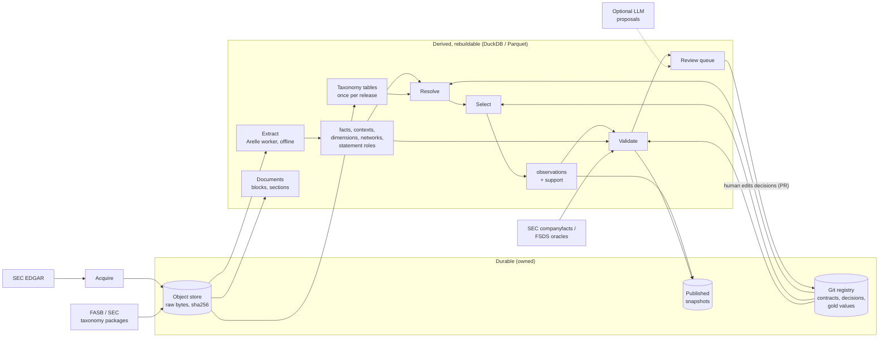

# 04 — Recommended architecture

## Stance

The system is a batch pipeline for one research team. It has three kinds of truth, each with
exactly one owner:

| Truth | Owner | Mutability |
|---|---|---|
| What was filed and published by SEC and standard setters | Object store: raw filing bytes, SEC-generated companions, official taxonomy packages | Immutable, content-addressed |
| What we decided it means | Git: metric contracts, semantic decision records, gold values | Versioned by commit, changed through reviewed PRs |
| What follows from the two | Derived columnar datasets, each stamped with producer version and inputs | Disposable; rebuilt, never migrated |

Everything else is implementation.

The design keeps the current evidence discipline: immutability, offline extraction and fidelity. It
removes second copies of truth, and it puts interpretation first, because interpretation is the
product.

## Components and ownership

| Component | Responsibility | Inputs → outputs | State |
|---|---|---|---|
| **Acquire** | Discover 10-K/10-Q filings; fetch primary documents, iXBRL, extension DTS files, `MetaLinks.json`, `FilingSummary.xml`; write filing manifests | SEC APIs → object store + `filings/{cik}/{accession}.json` | Durable |
| **Taxonomy** | Pin official taxonomy packages (US-GAAP, SRT, DEI, …); parse each release once into concepts, labels incl. documentation, references and standard networks | Packages → `taxonomy/{release}/*.parquet` | Packages durable; tables derived |
| **Extract** | Offline Arelle worker (packages + filing files, network guard). Produces per-report facts, contexts, dimensions, units, filer declarations, filer networks, roles, SEC statement classification, issues | Filing manifest → `extract/{version}/…/*.parquet` | Derived |
| **Documents** | HTML blocks and regulatory sections (current parser) | Filing manifest → `documents/{version}/…` | Derived |
| **Knowledge** | Metric contracts; semantic **decision records** (accepted, rejected, non-exact); gold values | Git `registry/` → validated in CI | Durable (Git) |
| **Resolve** | Expand accepted decisions to exact QNames; every fact gets zero or more `(metric, relation, decision_id)` supports | facts + taxonomy + decisions → `supports` | Derived |
| **Select** | Per issuer × metric × period dates × unit × scope × view, choose supporting facts or a typed non-publication reason | supports + contexts + policy → `observations` | Derived |
| **Validate** | Accounting identities, calculation consistency, SEC `companyfacts` agreement, gold values, cross-filing stability | observations + facts + oracles → `findings`, quality report | Derived |
| **Review** | Rank exceptions; optionally attach LLM proposals; humans resolve them by editing **decision records** in Git | findings + unmapped candidates → queue; decisions → PR | Queue derived; decisions in Git |
| **Publish** | Freeze a dataset: observations + support + findings + manifest (code commit, `decisions_commit`, extractor version, input hashes) | derived tables → `publications/{name}/{id}/` | Durable once written |

## Data flow



The only cycle runs through Git. Review changes decision records; accepted
decisions change derived outputs; the next build re-measures quality. No
database state feeds back into interpretation.

## Durable vs derived state

| State | Durable? | Identity | Rebuild path |
|---|---|---|---|
| Raw filing artifacts, SEC companions, taxonomy packages | Yes | SHA-256 | none (re-acquire) |
| Filing manifest: metadata, acceptance timestamp, retrieval time, artifact list | Yes | accession + manifest hash | none |
| Git registry: contracts, decision records, gold values | Yes | Git commit | none |
| Published snapshot | Yes (immutable once written) | publication id | none |
| Taxonomy tables | No | taxonomy release + parser version | reparse packages |
| Extraction tables | No | accession + report key + extractor version | re-run the worker |
| Document blocks and sections | No | accession + parser version | re-parse |
| Supports, observations, findings, queue | No | build id = (extractor version, `decisions_commit`, code version) | `edgar build` |

This split removes the need for schema migrations on evidence tables. When extraction output
changes, the extractor version changes and the tables are rebuilt. Correctness is protected by
tests and golden outputs, not by upgrade scripts.

Durable state is small and simple: bytes, JSON manifests, YAML in Git, and immutable Parquet
snapshots. It needs no server.

## Storage choice: embedded columnar instead of PostgreSQL

**Recommendation:** DuckDB as the query engine, with Parquet as the immutable interchange and
snapshot format. The working evidence store is a single DuckDB file, with per-report
delete-and-insert transactions (the same replace semantics as today). Publications are exported as
Parquet with manifests.

Why:

- The workload is batch analytics over facts. The target scale is roughly 10⁹ fact rows at full
  history.
- Columnar storage and compression suit this workload. Server row storage does not.
- PostgreSQL's distinctive strengths are concurrent transactional writers and a shared service.
  Those served the mapping ledger, which moves to Git.
- There is no server, no Docker, no Alembic, and no test-database lifecycle. Integration tests
  become fast temporary-file tests.
- Research users can read Parquet directly from pandas, polars, R or DuckDB.
- DuckDB `DECIMAL(38, s)` and Parquet decimals preserve exact values. The lexical form is always
  stored as well, and overflow is a typed extraction issue, never a float cast.

**Keep PostgreSQL instead if** any of the following is expected within a year:

- a multi-user service;
- concurrent writers from several machines;
- online serving.

In that case, still apply every other recommendation here: fewer tables, a taxonomy stored once,
knowledge in Git, and no migrations for regenerable tables. Decide with numbers from the scale spike
(08, P2): bytes per filing, full-rebuild time, and query latency for resolve and select over 1,000
filings.

## Interfaces

### CLI (batch, idempotent, JSON output for agents and scripts)

```text
edgar acquire   --cik … --form 10-K --since 2019      # bounded scope, as today
edgar taxonomy  load us-gaap-2024.zip                  # pin + parse a release
edgar extract   [--accession …] [--jobs 8]             # offline, parallel, per report
edgar build     [--view as-filed|latest]               # resolve → select → validate
edgar review    list|show <item>                       # exceptions, ranked by impact
edgar rules     check                                  # CI: schema, contract hashes, gold set
edgar publish   <name>                                 # freeze a snapshot with manifest
edgar sql                                              # DuckDB shell over all tables
```

The existing `filings` and `documents sections` commands keep their behavior. The `metrics` and
`mappings` commands become thin views over the Git registry and `build` outputs.

### Python boundaries

- `extract_report(manifest, packages) -> ReportTables`: Arrow tables with a fixed schema. It is the
  only engine boundary.
- `resolve(facts, taxonomy, decisions) -> supports`, `select(supports, contexts, policy) -> observations`
  and `validate(...) -> findings` are pure functions over tables, typically DuckDB SQL plus small
  Python.
- One record schema per table, defined once. The worker writes it; the parent validates the schema
  and integrity once, then commits.

### Knowledge files (Git)

Authored form is a **decision record**, not a bare runtime rule. One file is
the **current** semantic conclusion (Git current-state). A PR edits the
file; Git history is the revision log. There is no `supersedes` chain and
no YAML ledger.

`resolve` loads **accepted** decisions whose `contract_hash` equals the
current contract and expands them to exact QNames. **Rejected** decisions
with a current `contract_hash` are not applied; the review queue reads
them so the same question is not reopened without new evidence. A rejected
file whose `contract_hash` is stale remains visible as history but **must
not** suppress a new review. Stale **accepted** records are fatal to
resolve/build. Stale **rejected** records load as inactive history;
`edgar rules check` lists them as stale/review-needed and does not fail
`edgar build`.

**Uniqueness.** One current file per semantic key:

```text
(metric, source.family, source.issuer_cik or "", source.local_name)
```

Scope (`exclude_ciks`, `exclude_sic_divisions`) is an attribute of that
one file, not part of the key. A second file for the same key fails
`edgar rules check`. There is no scope-overlap algebra. A concept that
is exact outside banks and narrower for banks is recorded as
`relation: exact` plus a bank exclusion, not as a second narrower file.
That is enough for publication. If P2/P6 needs the bank relation itself,
add a scoped exception on this same file. Do not restore overlapping
assertions.
`relation: broader` + `status: accepted` already means “reviewed, not
exact.” Do not also keep `exact`/`rejected` for the same key. `rejected`
is only for a proposed relation with no affirmative alternative.

A **current** rejected decision (suppression power) needs the same
minimal evidence pointer as an accepted one.

```yaml
# registry/decisions/total_assets/us-gaap-Assets.yml
id: total_assets.us-gaap.Assets
metric: total_assets
source:
  family: us-gaap          # not a QName; see expansion below
  local_name: Assets
  exclude_qnames: []       # optional; Clark QNames dropped from expansion
relation: exact
scope: {}                  # or {exclude_sic_divisions: [H]}
status: accepted           # accepted | rejected
method: curated
rationale: "FASB documentation: carrying amount of all recognized assets"
evidence:                  # required when status=accepted; ≥ 1 item
  - kind: taxonomy_documentation
    source: metalinks
    artifact_sha256: "<sha256 of MetaLinks.json or taxonomy artifact>"
    concept: us-gaap:Assets
    # quote is optional
reviewed: {by: "<reviewer>", on: "<date>"}
contract_hash: "<sha256 of current contract>"   # required; accepted and rejected
```

```yaml
# registry/decisions/issuers/0001065088/DisposalGroup-product-development.yml
id: ebay.research_and_development.disposal
metric: research_and_development
source:
  family: issuer
  issuer_cik: "0001065088"
  local_name: DisposalGroupIncludingDiscontinuedOperationProductDevelopment
  exclude_qnames: []
relation: narrower
status: accepted
method: reviewed
rationale: "Disposal-group product development is a component of R&D, not the total."
evidence:
  - kind: filer_documentation
    accession: "0001065088-24-000036"
    locator: "ebay_DisposalGroupIncludingDiscontinuedOperationProductDevelopment"
reviewed: {by: "<reviewer>", on: "<date>"}
reviewed_occurrences:
  - accession: "0001065088-24-000036"
    source_qname: "{<issuer-namespace>}DisposalGroupIncludingDiscontinuedOperationProductDevelopment"
contract_hash: "<sha256 of current contract>"
```

Terminology:

```text
authored object     = Decision          (this YAML)
runtime derivative  = Support           (expanded exact QNames + fact ids)
lineage key         = decision_id
CLI name            = edgar rules check may stay (it validates decisions)
```

**Taxonomy family** is a shared prefix table, not “starts with fasb.org”:

```text
semantic_family:  us-gaap | dei | srt | other
origin:           standard | issuer

us-gaap / dei / srt are the three semantic families (prefixes in P0).
origin=standard also for any other http(s) host in
  xbrl.sec.gov | fasb.org | xbrl.us
  (CYD, ECD, FFD, country, … — not an enumerated list)
origin=issuer for filer-owned hosts.
```

P3 packages replace the host rule with package provenance. The same
classifier is used for P0.3 grain, QName expansion, required-context
lookup, MetaLinks joins, and P2 reporting. 2009 `xbrl.us` and 2011
`xbrl.sec.gov` DEI must classify as `dei` + `standard`.

**QName expansion** (runtime, not identity):

```text
decision (family + local_name − exclude_qnames)
    → exact QNames of facts this decision covers
P1 algorithm:
  if family in {us-gaap, dei, srt}:
      semantic_family(namespace) == family
  if family == issuer:
      origin(namespace) == issuer
      AND filing.cik == source.issuer_cik
      # semantic_family is "other" for filer namespaces; never "issuer"
  and local_name equals
  and Clark QName ∉ exclude_qnames
Later: same, plus taxonomy-table drift checks (type / period / balance /
       documentation). Material drift **queues / proposes** an
       exclude_qnames edit. Derived validation must not mutate Git.
       A human PR edits the decision.
```

Default is family-wide continuity. `exclude_qnames` is the escape hatch
when a later release (or an issuer reusing a local name) is **not** the
same concept. Do not require a per-year decision unless an exception
exists.

Source facts always keep the expanded QName
`{http://fasb.org/us-gaap/2023}Assets`. The family string is never stored
as a concept identity.

The gold set lives beside decisions, for example `registry/gold/*.yml`.
Values are verified against rendered statements. The M0 benchmark's values
and counterexamples migrate there, without the review-process fields.

A derived expansion snapshot is optional for debugging. It must be
generated from decisions, never hand-edited as a second authority.

## Data model essentials

The per-report extraction tables are:

- facts;
- contexts;
- context dimensions;
- units;
- declarations (`base_concepts` = fact concepts ∪ relationship endpoints ∪
  all issuer-extension declarations);
- labels and references whose subject is in `base_concepts` (unused
  standard-taxonomy resources are not stored per report);
- relationships (all networks in the filing DTS extension linkbases);
- roles (URI, definition, `usedOn`);
- statement classification (from `MetaLinks.json` / `FilingSummary.xml`);
- issues.

Standard concept metadata is joined from taxonomy tables by `(namespace, local_name)`. The taxonomy
family and release are derived from the namespace URI.

This is about 11 tables instead of 17. More importantly, it holds roughly 3–6% of today's
declaration volume: used standard concepts plus filer declarations, instead of ~18.5k rows per
report.

Observation rows carry the following, and every published number resolves to exact source bytes
through them:

- issuer, metric, period (start/end or instant), unit, scope, and view;
- derived `fiscal_year` and `report_focus` (`Q1 | Q2 | Q3 | FY`) when a
  unique issuer-period **anchor** matches (own filing required context +
  that filing's DEI FY/focus). Observation `period_role` (not context
  `period_kind`) is operational (see P5): 10-K required duration →
  `annual`; Q2/Q3 required → `YTD`; explicit three-month duration →
  `quarter`; Q1 required duration → `quarter_ytd`. Instant facts are
  `instant`. Context `period_kind` stays `duration | instant | forever`.
  Identity remains the dates. No unique match → year/focus unknown;
- value, unit and decimals;
- status (`value | missing | conflict | unmapped_candidate | unsupported`);
- supporting fact ids, `decision_id`s and the relation;
- the filing supplying the value, and `available_at` (the SEC acceptance timestamp);
- validator flags.

## What stays as it is

- SEC client, acquisition, object store and filing manifests (bundles), with one snapshot identity
  instead of four.
- The Arelle worker boundary, network guard and fail-closed extraction rules.
- The fact, context, dimension and relationship fidelity rules, and their tests.
- The document and section parser, and its tests.
- The relation vocabulary and contract-hash invalidation.
- All `AGENTS.md` source invariants:
  - immutable bytes;
  - `Decimal`;
  - identifiers;
  - timestamps kept distinct;
  - no dropped extensions;
  - no dimensional aggregation without policy.

## What goes away

- The second record family and the wire codec.
- Receipts, as a separate object: a manifest per build and per publication replaces them
  (same identity fields: hashes, versions, fact counts, issue counts).
- Integrity re-checks beyond **one** runtime completeness boundary: every
  Arelle item fact is persisted or becomes an explicit issue, checked at
  commit. Fixture goldens remain. The other eleven check sites go.
- Closure capture and replay verification for standard taxonomies. Extension files remain part of
  the filing.
- Per-report standard declarations and locators.
- The PostgreSQL source schema and its migrations.
- The registry DB mirror and the PostgreSQL mapping-ledger *implementation*
  (propose/accept lifecycle, mutation triggers). **Ledger semantics stay:**
  decision records in Git, including rejected and non-exact conclusions.
- The planned review profiles, qualification packets, knowledge clocks, publication notices and
  multiple hash schemes (see 07 for what this gives up).
