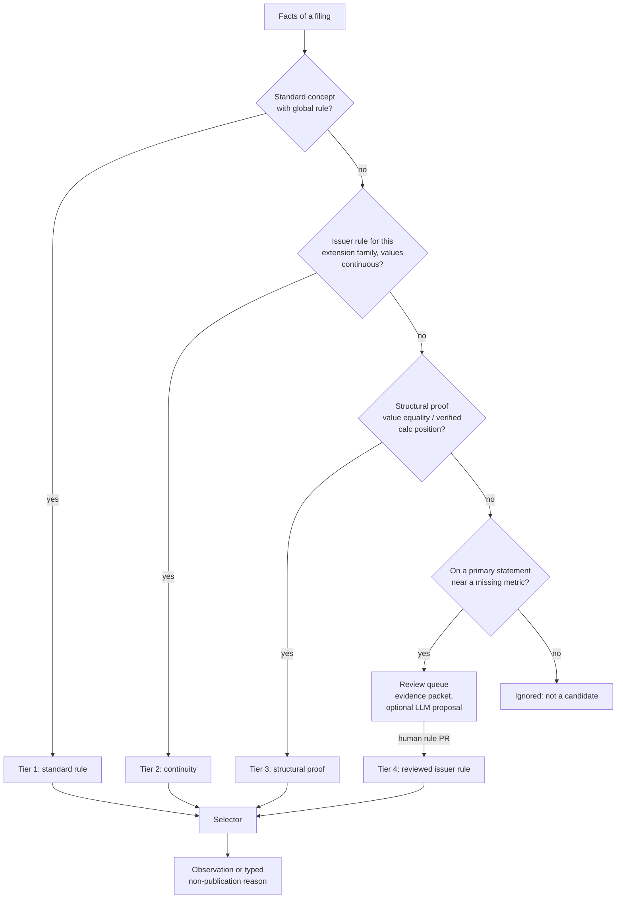

# 05 — Mapping strategy

Mapping is the product. This document derives a strategy from the problem and the data, rather
than from the adopted plan. It then says how its quality will be measured.

## 1. Three questions, three owners

"Mapping" bundles three different questions. They have different answers, different owners and very
different costs.

| Question | Example | Who knows the answer | How often it must be answered |
|---|---|---|---|
| **Q1 Concept meaning:** what does filed concept C mean? | `us-gaap:NetIncomeLoss` is "profit or loss … attributable to the parent" | FASB for standard concepts; the filer for extensions | Once per standard concept (per release); once per extension family |
| **Q2 Contract relation:** how does C relate to metric M? | `Revenues` is *broader* than `revenue`; `RevenueFromContractWithCustomer…` is *exact* (outside banks) | Us, as a reviewed rule with conditions | Once per (metric, concept family, condition) |
| **Q3 Selection:** which fact is the value for issuer × metric × period? | the undimensioned, registrant-entity, required-period fact; consistent duplicates reduced to the most precise | Deterministic policy using EDGAR and XBRL conventions | Computed for every filing; never reviewed by hand |

The adopted plan folds all three into **per-report claims with per-occurrence human
qualification**:

- extension claims default to issuer + listed reports;
- "exact" needs affirmative definition evidence per claim;
- consolidated scope, basis and sign are human conclusions per occurrence.

Human effort then grows with filings × metrics.

Separating the questions makes effort grow with *distinct semantics* instead:

- Q1 and Q2 for standard concepts are global and decided once.
- Q3 is mechanical.
- Only extensions and genuine exceptions need case-level attention.

## 2. What the data says

Local corpus of six filings (details in [A](A-evidence-and-method.md)):

- **85.6%** of facts use standard concepts. On SEC-classified primary statements, extensions are
  **2–14%** of non-abstract line items per filing (WMT 2%, KO 5%, eBay 11% in both years, JPM 14%).
- All 13 hand-verified benchmark values are standard concepts. An **eight-row global rule table** (one standard concept per metric) plus
  a selector reproduces **13/13**. The selector takes the registrant entity, no dimensions, a USD
  unit, and the period of the EDGAR required context (the context carrying
  `dei:DocumentPeriodEndDate`).
- The nine non-value cases are consistent with the rules. Broader, narrower and related concepts are
  never in the exact table. Slots without an exact undimensioned fact return `missing`: bank
  revenue, segment/YTD, the 10-K/A without statements, and Walmart R&D.
- **Two cases the manual process left open are resolvable from standards already in the bundle:**
  - *Parent net income:* the FASB documentation for `NetIncomeLoss` defines it as attributable to
    the parent. That text is in every bundle's `MetaLinks.json`. The identity
    `ProfitLoss = NetIncomeLoss + NetIncomeLossAttributableToNoncontrollingInterest` detects
    filer mis-tagging where both are present.
  - *Walmart cash:* the two facts, 9,867,000,000 at `decimals=-6` and 9,900,000,000 at
    `decimals=-8`, are **consistent duplicates**. Rounding the first to −8 gives the second. The
    XBRL duplicate-facts guidance treats them as one fact, with the more precise value
    authoritative.
- **Issuer extension local names persist across years** while the namespace date changes (eBay
  2022 → 2023). Issuer continuity is therefore a cheap, strong reuse signal.

Six filings do not prove market-scale coverage. They do show that the plan's central premise, that
safe mapping needs per-report human qualification, does not hold for the cases it was designed
around.

## 3. Evidence available for mapping

| Source | What it provides | Strength | Cost / availability |
|---|---|---|---|
| FASB documentation labels and authoritative references | Authoritative meaning of standard concepts (Q1) | Strong | In every bundle via `MetaLinks.json`; complete via taxonomy packages |
| SEC statement classification (`MetaLinks`/`FilingSummary`: `groupType`, `longName`) and EDGAR role definitions | Whether a concept is on a primary statement, and which one | Strong | In every bundle; unparsed today |
| Filer calculation linkbase | Arithmetic parent/child relations and weights in this filing | Strong for structure; filer calc errors occur | Extracted today |
| Filer presentation linkbase | Line position and order, preferred labels (e.g., negated, total) | Medium | Extracted today |
| Filer extension labels and documentation | Filer's stated meaning of extensions | Medium (free text) | Extracted today |
| Definition linkbase and dimensions | Segment vs consolidated scope; axes and members | Strong for scope | Extracted today |
| Issuer history | The same extension local name was already mapped in earlier filings | Strong when values are continuous | Free once rules exist |
| Value corroboration | The extension fact equals a standard-concept fact, a comparative or an identity residual | Strong for the specific occurrence | Cheap SQL |
| Accounting identities | Balance sheet, cash-flow roll-forward, NCI split, gross profit | Strong validators | Cheap SQL |
| SEC `companyfacts` / frames | SEC's per-concept series (standard taxonomies, non-dimensional) | Strong oracle for extraction + selection | Free API, one call per issuer |
| SEC Financial Statement Data Sets | Market-wide numbers with statement and line position, plus custom-tag labels | Strong for coverage estimation and evaluation at scale | Free quarterly downloads |
| Open-source standardization maps (e.g., EdgarTools, secfsdstools, XBRL US Fundamental Accounting Concepts) | Concept → line-item mappings | Unknown precision; usually no rationale | Free; seeds only, to be measured |
| LLM reading the evidence packet | Semantic judgement on extensions and edge cases | Medium; must be measured | Local model or API; non-deterministic |

## 4. Strategy comparison

| Strategy | Accuracy | Coverage | Explainability | Cost | External dependence | Suitable for automation | How confidence is established |
|---|---|---|---|---|---|---|---|
| **S1** Per-report human review + occurrence qualification (adopted plan) | High on reviewed cases | Very low; bounded by reviewer hours | High | Very high, O(filings × metrics) | None | No | Human attestation, unmeasured |
| **S2** Global rules on standard concepts + deterministic selector | High; residual is filer mis-tagging | High for standard-tagged metrics; zero for extension-only | Very high (one rule, one definition) | Very low (hundreds of rule decisions, once) | Taxonomy only | Full | Validators, oracle agreement, gold precision |
| **S3** Issuer extension rules by review, reused via continuity | High | Targeted | High | Moderate, O(distinct extension patterns); amortized | None | Reuse is automatic, guarded by value continuity | Review + continuity checks |
| **S4** Structural proof for extensions (calc position, value equality, statement role) | Medium–high when proof conditions are strict | Moderate | High (the proof is recorded) | Low (code + one policy review) | None | Yes, under reviewed policies | Per-policy precision on gold |
| **S5** Third-party mapping tables | Unknown, varies | Broad | Low–medium | Low | Maintainer, license | Proposals only | Must be measured against gold |
| **S6** Label or embedding similarity | Low–medium (labels do not prove equivalence) | Broad | Low | Low | Embedding model | Candidate retrieval only | Not a basis for acceptance |
| **S7** Supervised classifier | Possibly good | Broad | Low | Labeled data + upkeep | Training data | Premature | Held-out precision |
| **S8** LLM proposal (one structured call per candidate) | Medium–high on semantic reading; fails on broader/narrower subtleties | Broad | Medium (rationale, not proof) | Low per call | Model, prompt version | Proposals; accept only with deterministic corroboration or human review | Measured precision per model × prompt version |
| **S9** Autonomous agent framework | No gain over S8 for a bounded classification | Broad | Low (multi-step traces) | Higher; orchestration state | Framework + model | Poor | Hard to measure |
| **S10** Use `companyfacts`/FSDS as the primary source | High for what it covers | Standard concepts only; no dimensions, no extensions; no statement structure in `companyfacts` | Medium (SEC-derived) | Very low | SEC's derivation | Full | Inherits SEC's choices |

Notes on the less obvious rows:

- **S1 fails on cost, not accuracy.** At 5,000 issuers × 39 metrics × one annual filing, even one
  minute per slot is ~3,250 reviewer-hours per year, before quarterlies. Consistency across
  reviewers is not measured. Reviews also go stale when contracts change.
- **S2's main risks are known and testable:**
  - Filer mis-tagging, caught by identities and the oracle.
  - Industry semantics, such as bank revenue. These are handled by rule conditions on SIC-derived
    industry, not by per-report review.
  - Taxonomy deprecations. The taxonomy table lists concepts per release, so a deprecated concept
    simply stops matching new filings. Its replacement gets a rule.
- **S4 needs strict proofs.** Examples:
  - An extension's value equals a standard-concept fact for the same context.
  - An extension is the calculation parent of the same children as a standard total, and the
    arithmetic verifies.

  Calculation linkbases contain filer errors, so proofs that rely on them must also verify the
  arithmetic on the facts.
- **S8 must not decide.** It reads the evidence packet (definition, statement position, calc
  neighbours, values, prior mapping) and proposes `(metric, relation, rationale)`. Acceptance comes
  from a deterministic S4 proof or a human. This is consistent with `AGENTS.md`.
- **S9 adds nothing** that one structured LLM call plus deterministic tools does not. A
  general-purpose coding agent is useful for *investigating* the review queue through the CLI and
  SQL. Nothing in the pipeline should depend on an agent framework.
- **S10 is an excellent oracle and a poor foundation.** It covers only non-dimensional
  standard-taxonomy facts. It encodes SEC's own frame-selection choices. It cannot represent the
  counterexamples the project cares about.

## 5. Recommended staged strategy

**Stage 1: global rules and selector.** Build this first.

- Global rules for the eight benchmark contracts, then all 39. Each metric gets its exact concept
  families, plus explicit broader and related concepts that are never published as exact.
- Industry conditions from SIC for banks, insurers and REITs.
- The annual selector (section 6).
- Validators and the SEC `companyfacts` oracle.
- The gold set.
- Expected effort is a few days of rule authoring, because the rules are decided once per concept
  family.

**Stage 2: extensions by continuity and proof.** Rank the residual:

1. Issuer-years where a headline metric is `missing` but the matching primary statement contains an
   unmapped line item.
2. Apply Tier 2 continuity and Tier 3 proofs.
3. Generate an evidence packet for the rest: definition, labels, statement and line position, calc
   parent and children, values, prior-year mapping, and the identity residual it would close.

Humans resolve queue items by writing issuer rules, which are then reused automatically.

**Stage 3: LLM proposals for the queue.** Use a versioned prompt with a schema-validated output, and
record the model, input hash and parameters, as `AGENTS.md` requires.

Proposals only reorder or pre-fill review. A proposal becomes a rule when either:

- a Tier 3 proof confirms it; or
- a human accepts it.

Measure the proposal precision per model and prompt version. Stop using the step if it does not
save review time.

**Stage 4: harder semantics, when the data demands them.**

- Quarterly and YTD selection, with Q4 derived from the annual figure minus nine months as a
  flagged *derived* observation.
- Dimensional metrics (segments) with an explicit policy.
- Issuer-specific contract variants, such as bank revenue.

### Acceptance tiers

| Tier | Basis | Accepted by | Typical share (hypothesis, to be measured) |
|---|---|---|---|
| 1 Standard rule | FASB definition + reviewed global rule | Policy, automatically | Most headline observations |
| 2 Continuity | Reviewed issuer rule, same extension family, comparative values agree | Policy, automatically | Recurring extensions |
| 3 Structural proof | Value equality or verified calculation position | Reviewed policy, automatically; precision monitored | Some new extensions |
| 4 Reviewed | Human-reviewed issuer rule (possibly LLM-proposed) | Human | Residual |
| — Unresolved | — | Not published; queued | — |

Every observation records its tier and rule ids. Datasets can filter by tier; for example, a
conservative study uses Tiers 1–2 only.

## 6. Observation selection (deterministic, standards-based)

The `annual-v1` selector works per 10-K or 10-K/A:

1. **Report period.** Take the EDGAR required context: the undimensioned context of the DEI cover
   facts, such as `DocumentPeriodEndDate`. Duration metrics use its start and end; instant metrics
   use its end. Fiscal year and period come from `DocumentFiscalYearFocus` and
   `DocumentFiscalPeriodFocus`.
2. **Candidates.** A candidate fact must satisfy all of the following:
   - its concept has an applicable exact rule (Tiers 1–4, conditions satisfied);
   - its entity is the registrant;
   - it has no dimensions. Arelle is not allowed to invent defaults; undimensioned means the
     default (consolidated) member.
   - its unit matches the contract's unit dimension;
   - its period matches as in step 1;
   - it is valid and non-nil.
3. **Duplicates.**
   - Identical values collapse to one.
   - Values consistent under decimal rounding collapse to the most precise.
   - Otherwise the result is `conflict`.
4. **Several exact concepts** with the same value give one observation with several supports. With
   different values the result is `conflict`. There is never silent precedence.
5. **Non-publication reasons.**
   - `missing`: no candidate.
   - `unmapped_candidate`: a primary-statement line item in the matching context has no rule.
   - `unsupported`: the contract is excluded for this industry.
   - `broader_only`: only broader concepts are present.
6. **Views.**
   - `as-filed`: the filing's own period.
   - `first-reported`: the earliest acceptance that reports the slot.
   - `latest-as-of(T)`: the latest acceptance ≤ T, including comparatives in later filings. It is
     flagged when it differs from as-filed.

   `available_at` is the SEC acceptance timestamp of the supplying filing.

Amendments need no special machinery. A 10-K/A with full statements competes like any filing. One
without statements, such as the eBay 10-K/A with 37 cover facts, contributes no candidates.

## 7. How confidence is established

Confidence is evidence, not a model score, and it is reported at three levels:

- **Rule:** basis (definition text, proof type, reviewer) and tier. The tier's *measured* precision
  on the gold set.
- **Observation:**
  - identity checks (pass / fail / not applicable);
  - oracle agreement (equal / differs / absent);
  - duplicate consistency;
  - cross-filing stability (as-filed vs next year's comparative).
- **Dataset:** coverage, precision, conflict and unmapped rates per metric × tier × industry × fiscal
  year.

A coarse grade (for example A = Tier 1–2, identities pass, oracle agrees) is a convenience for users.
It must stay derivable from the flags.

## 8. Measuring mapping quality empirically

| Measure | Definition | Needs labels? |
|---|---|---|
| Precision | Published values equal to gold values, per metric × tier | Gold set |
| Oracle agreement | Selected standard-concept values equal to SEC `companyfacts` for the same accession and period | No |
| Identity pass rate | Share of issuer-years where applicable identities hold within rounding | No |
| Coverage | Issuer-years with a value ÷ issuer-years where the metric applies (industry conditions) | No |
| Conflict / unmapped rates | Typed non-publication shares | No |
| Stability | As-filed values equal to next year's comparative, or explained by a restatement flag | No |
| Review load | Queue items per 1,000 filings; resolution time; items per tier | No |

**Gold set.**

- Seed it with the M0 values and counterexamples.
- Grow it to about 200 issuer-years × 8 metrics, stratified by industry, size, year and extension
  intensity.
- Label values from the SEC-rendered statements (R files), and double-label ~10% to estimate label
  error.
- With ~1,600 labels, a 99% observed precision has a 95% interval of about ±0.5 pp. That is enough
  to compare tiers and releases.
- Add a fresh stratified sample each quarter to detect drift.

**Regression discipline.**

- Every rules or selector change runs `edgar build` on the fixture corpus and the gold set in CI.
- CI emits a quality-report diff.
- A drop in precision beyond a threshold fails the build.
- The M0 counterexamples become unit tests of the selector: bank, segment, YTD, amendment, broader,
  related, narrower extension, NCI.

**Scale measurement before building Stage 2.** Run Stage 1 on 500–1,000 filings (08, P2) and report
coverage, oracle agreement and identity pass rates per metric. FSDS can estimate market-wide
concept usage per metric before extracting anything. The Stage 2 investment should be sized by the
measured residual, not by assumption.

Working hypotheses for P2 to confirm or refute:

- Total assets and operating cash flow: ≥95% coverage for non-financial issuers, with ≥99.5%
  precision.
- Revenue: 75–90% coverage, depending on industry and concept diversity.
- R&D: coverage limited by applicability, where `missing` is often correct.

## 9. Failure modes and mitigations

| Failure mode | Where it bites | Mitigation |
|---|---|---|
| Filer mis-tags a standard concept (e.g., consolidated NI as `NetIncomeLoss`) | Tier 1 | Identities; oracle; issuer-level override rule |
| Standard concept broader than the contract in some industries (bank revenue) | Tier 1 | SIC conditions; `unsupported` status; separate contract |
| Extension semantics change under the same local name | Tier 2 | Require comparative-value continuity; label/documentation diff triggers review |
| Calculation linkbase errors | Tier 3 | Verify arithmetic on facts, not only arcs |
| Scale/sign errors (thousands vs units; negated labels) | All | Values come from resolved XBRL (`scale` applied by the transform); sign follows the concept's definition; DQC-style sanity checks |
| Duplicate facts with inconsistent values | Selection | `conflict`, never pick |
| Wrong period (YTD vs quarter; fiscal-year shifts) | Selection | Required-context anchoring; period-length checks; quarterly policy deferred to Stage 4 |
| Contract changes silently invalidating rules | Knowledge | `contract_hash` in each rule; CI fails until re-affirmed |
| LLM plausible-but-wrong proposals | Stage 3 | Never authoritative; measured precision; proof or human acceptance |
| Gold labels wrong | Measurement | Double labeling; disagreements reviewed |

## 10. Human effort model

| Work | Adopted plan | Recommendation |
|---|---|---|
| Standard concepts | Claims plus per-occurrence qualification: O(filings × metrics) | ~150–300 rule decisions once (39 metrics × a few concept families) + industry conditions |
| Extensions | Claims scoped to issuer + listed reports; each new filing re-enters review | One decision per extension family; reuse checked automatically |
| New filings | Qualification per new report | None unless a validator fails or an unmapped candidate appears |
| Contract changes | Re-review of affected claims | Re-affirm rules whose `contract_hash` changed (CI lists them) |
| Quality assurance | Review attestation | Measured: gold set, identities, oracle |

## 11. Policy changes this requires (ADR)

1. Replace claim-level and occurrence-level human qualification with **policy-level review plus
   measured precision**.
2. Allow **deterministic** Tier 2 and Tier 3 auto-acceptance under reviewed policies. LLMs never
   accept.
3. Accept FASB documentation, from `MetaLinks.json` or taxonomy packages, as the affirmative
   definition evidence for standard concepts.
4. Adopt XBRL duplicate-fact consistency and the EDGAR required context as the selection primitives.
5. Move mapping authority from the PostgreSQL ledger to Git-reviewed rule files.
