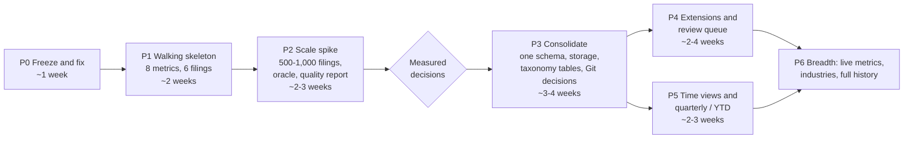

# 08 — Assessment of the current migration plan

## Verdict

The M0→M1A→M2→M3→M4 sequence (ADR 0012, `docs/architecture/migration-plan.md`) is ordered by
*infrastructure dependency*, not by *risk*.

- **The hardest assumption is first touched late and small.** Correct canonical mappings and
  observations at scale with little human effort are first exercised at M3, on nine slots. Scale is
  never exercised: M5 is "expand on demonstrated failures".
- **M3's value target is already met.** It asks for revenue, total assets and operating cash flow
  for the two eBay years and Walmart. An eight-row rule table (one standard concept per metric) produces those nine values from today's
  tables, plus four more.
- **Most of the path to M3 builds assurance machinery for a review process** that the evidence does
  not show to be necessary for these cases, and that cannot scale.

Recommendation:

1. Keep the benchmark and the fidelity work.
2. Pause the remaining M1A items and M2.
3. Build the M3 objective first, as a walking skeleton.
4. Test it at scale.
5. Consolidate infrastructure only after measurements say what is needed.

## Phase-by-phase review

| Phase / item | Assessment | Recommendation |
|---|---|---|
| **M0** benchmark (done) | Strong content: independently verified values and well-chosen counterexamples. Over-built wrapper: 9.4k words of review-process fields, 2.3k lines of static validators, a forked contract set (`metric-v2`, two keys not in the live registry). The values are never tested against the pipeline. | Keep the values and counterexamples as a gold file keyed by live contracts; add one pipeline test; retire the validators |
| **M1A-1** receipts (done) | Identity fields are useful; a separate receipt object threaded through every layer is not. | Keep fields until P3, then fold them into the build/publication manifest |
| **M1A-2** link/arc QNames (done) | Genuine fidelity repair; small. | Keep |
| **M1A-3** integrity + upstream inventory (done) | Independent re-count is valuable as a *test*; as a runtime layer it adds a fourth check site. | Keep the inventory as a test/QA tool; one runtime assertion |
| **M1A-4** inspector | Useful for review, but premature: no queue exists. SQL over the store plus an evidence-packet generator (05) covers it. | Defer to P4, as part of the review queue |
| **M1A-5** official taxonomy packets (ADR 0013) | Solves a real gap (FASB definitions) with a per-case acquisition procedure. The same definitions are already in every bundle's `MetaLinks.json`. | Replace: parse `MetaLinks` in P1; taxonomy packages as a general capability in P3 |
| **M1B** case-triggered evidence | The triggering discipline is sound. Role definitions become a trivial table in the new extraction. | Keep deferral; add the roles table in P3 |
| **M2** precise contracts | Contract tightening (cash vs restricted cash, PP&E payments vs capex, basis and sign) is necessary. Everything else serves a ledger with zero rows: `metric-v1/v2` schemes, DB snapshot table, mutation triggers, locking, conditions in the ledger, correction links, profile validator, historical claim migration. | Do the contract edits in YAML in P1; replace the ledger with Git decision records + `contract_hash` + CI |
| **M3** first annual release | Correct objective, correct deterministic-selector idea, correct "every slot gets a result" rule. It forbids consistent-duplicate resolution, requires per-occurrence human qualification, and adds status scans and notices. | Move to P1; adopt XBRL duplicate consistency and required-context anchoring; manifest export without notices |
| **Optional DTO consolidation** (after M3) | Right idea, wrong time. Every M1A/M1B/M2 change pays the four-representation cost first; M1A-1–3 added 7.8k lines partly for that reason. | Do it in P3, immediately after the skeleton proves behavior; parity by golden diff |
| **M4** time policies and quarterly | As-filed, first-reported and latest-as-of are right. Coverage-cohort blocking ("unreviewed later coverage blocks latest") is an artifact of per-report mapping scopes. Three knowledge clocks and `amends` edges are unnecessary for per-slot selection. | P5: views by acceptance time; per-slot selection handles partial amendments; `decisions_commit` replaces `semantic_as_of` |
| **M5** menu | "Standard-taxonomy continuity" is labelled optional but is on the critical path (below). Parquet/DuckDB export is listed as a late option but is the natural research format. AI proposals are correctly gated. | Continuity in P1 (decisions keyed on namespace family + local name); Parquet in P1; AI in P4 |

## Hidden dependencies

1. **Taxonomy release continuity blocks multi-year data.**
   - The plan keeps namespace releases as distinct QNames, and "namespace/local-name continuity
     never auto-accepts" (M5).
   - The six filings already use three US-GAAP releases (2022, 2023, 2024). M3's nine slots alone
     span two of them.
   - A 15-year series spans more than 15 releases. Every mapped standard concept then needs
     re-claiming per release, and the work that avoids this is deferred to an optional phase.
   - Global rules keyed on the namespace family and local name, validated against each release's
     concept list, dissolve this dependency.
2. **Review throughput gates M4.**
   - "Latest" is blocked by unreviewed later coverage, and "first" by unreviewed earlier coverage.
   - Every filing in a cohort must therefore be reviewed before a time series exists.
   - The plan estimates no reviewer hours; 05 §4 puts S1 at ~3,250 hours per year for annual data
     alone.
3. **Contracts are forked.** The benchmark's eight `metric-v2` contracts must be reconciled with the
   39 live `metric-v1` contracts before M3 can use the benchmark. Two benchmark keys do not exist in
   the live registry.
4. **There is no data to migrate.** The working DB is at `0001` with no `registry` schema, so no
   claims exist. Still, M1A stages nullable fields for old rows, and M2 designs historical claim
   migration, legacy hash decoding and restore paths for that non-existent data.
5. **Extraction speed has no owner.** At ~100 s per filing no phase can exceed a few hundred filings
   comfortably. The quadratic locator scan is not on the plan.
6. **Fiscal-period determination is not scoped.** M3's selector needs the report's own fiscal period.
   DEI and the required context are mentioned as "discovery aids" in M4, but no work item builds
   them.
7. **No independent reference exists for quality.** Correctness rests on the reviewers who wrote the
   benchmark. No phase introduces an oracle (`companyfacts`, FSDS) or identity checks.

## Where the plan moves complexity instead of removing it

| Stated simplification | Where the complexity reappears |
|---|---|
| Conservative per-report extension claims instead of reuse | M4 coverage-cohort blocking; M3 review-effort reports; M5 reuse policy and drift reports |
| No durable mapped-fact / observation lifecycle | Typed qualification conclusions bound to occurrences, receipts and ContractRefs; publication status scans and notices to handle revocation |
| No reference warehouse or taxonomy index (M1A) | Per-case external evidence packets from pinned official packages (ADR 0013), each acquired and inspected separately |
| DTO consolidation deferred to avoid risk | Every intermediate change is paid four times (M1A +7.8k lines) |
| No workflow engine or profile database | A typed profile validator, capability states, relevance states and check groups in YAML and code |
| Knowledge immutability without runtime roles | DB mutation triggers, definition locking, successor copies and correction links. This is a reimplementation of what Git gives by default. |
| No point-in-time guessing | Three clocks, anchored evidence rules and `knowledge_time_unknown` states. A `decisions_commit` per build answers the same question. |

## Infrastructure ahead of demonstrated need

- **Receipts and upstream inventory.** Built before any consumer of receipts exists.
- **Inspector.** Planned before a review queue exists.
- **Ledger triggers, locking and hash schemes.** Designed before a single mapping decision or
  contract change.
- **Publication notices and status scans.** Designed before any publication.
- **Official-package acquisition.** Planned while the same definitions sit unparsed in every bundle.
- **Nullable staging and legacy decoding.** Planned for data that can be rebuilt in minutes.

## Revised sequence

Implementable step files (files to change, algorithms, tests, and gates) live
in [plan/](plan/README.md):

| Phase | Spec | Exit criteria |
|---|---|---|
| **P0 Freeze and fix** | [plan/P0-freeze-and-fix.md](plan/P0-freeze-and-fix.md) | ADR accepted; 10-K extract ≤ 25 s; facts/relationships unchanged; `make check` green |
| **P1 Walking skeleton** | [plan/P1-walking-skeleton.md](plan/P1-walking-skeleton.md) | 13/13 gold values plus resolved parent NI and Walmart cash; counterexample statuses pinned; `edgar build --check-gold` |
| **P2 Scale spike** | [plan/P2-scale-spike.md](plan/P2-scale-spike.md) | 500–1,000 10-Ks; quality + oracle report; storage and taxonomy ADRs |
| **P3 Consolidate** | [plan/P3-consolidate.md](plan/P3-consolidate.md) | Fact-level parity; Git-only knowledge; production code ≤ ~18k lines |
| **P4 Extensions and review** | [plan/P4-extensions-and-review.md](plan/P4-extensions-and-review.md) | Ranked queue; observation precision on gold; Tier-3 candidate precision if reviewed; narrower never publishes as exact |
| **P5 Time and quarterly** | [plan/P5-time-and-quarterly.md](plan/P5-time-and-quarterly.md) | first/latest views; KO/JPM counterexamples hold; derived Q4 flagged |
| **P6 Breadth** | [plan/P6-breadth.md](plan/P6-breadth.md) | Published quality report per metric × industry × year |

This reaches a measured, market-sample annual dataset in about **5–6 weeks** (P0–P2). It reaches a
consolidated system with extensions and time views in roughly **3–4 months**. The adopted plan
reaches nine slots on six filings at M3, after M1A and M2.

Revisions after the hybrid-architecture critique ([B](B-feedback-response.md)): Git holds
**decision records** (not only active rules); Tier 3 does not auto-accept; `annual-v1` is
10-K/10-K/A only; P5 slot identity is the period, not the supplying filing's DEI focus;
accession change is not a restatement.

Specification hardening after the second critique ([C](C-feedback-response.md)): OIM
interval duplicates; Git current-state decisions (no `supersedes`);
`contract_hash` on rejected records; `exclude_qnames`; required evidence on
accepted decisions; non-circular P0.3 keep-set; exact USD unit + SEC CIK
scheme; conservative FY/FP anchors; observation precision vs Tier-3 candidate
precision; `decision_id` lineage.

Third hardening pass ([D](D-feedback-response.md)): historical taxonomy-family
prefixes; OIM grouped by data point; one conclusion per semantic key; stale
rejection is history-only; P2 semantic audit + era-aware coverage; oracle on
period dates; P3 dimensional parity; overlap-period Tier 2; tier on the
application; `report_focus` vs `period_kind`. Architecture review is
**finished**; remaining work is implementation.

## What to keep from already-merged M1A work

- **Link/arc QNames (M1A-2):** keep as is.
- **Receipt fields (M1A-1):** keep until P3, then move into manifests.
- **Upstream inventory (M1A-3):** keep as a test utility; remove it from the runtime path in P3.
- **Migration `0005`:** keep while PostgreSQL remains. It becomes moot if storage moves.

## Risks of the revised sequence

- **P2 may show low standard-concept coverage for some metrics.** That is valuable early knowledge,
  and it sizes P4. It is not a reason to delay measuring.
- **The storage change in P3 is the largest mechanical risk.** It is mitigated by doing P1 on the
  existing tables, by deciding with P2 numbers, and by fact-level golden parity.
- **Global-rule errors propagate widely.** This is mitigated by identities, the oracle, the gold
  set, and a quality-report diff in CI (07, T4).
- **Governance change.** The ADR must state explicitly that assurance moves from per-decision
  attestation to measured, policy-level quality (07, T3). That is the real decision; the rest
  follows from it.
